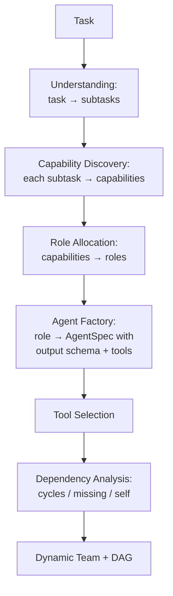
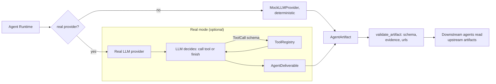
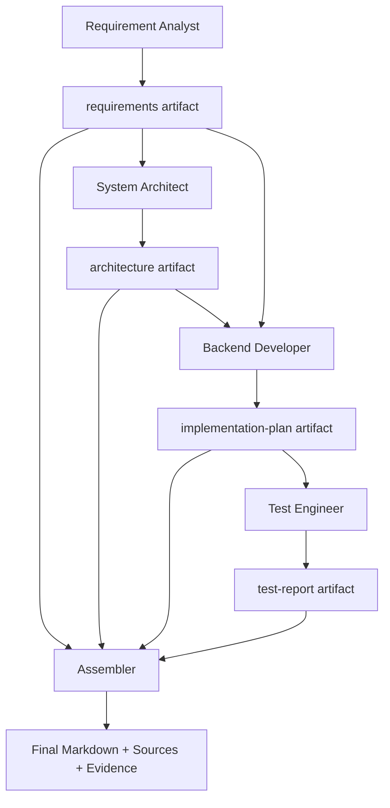
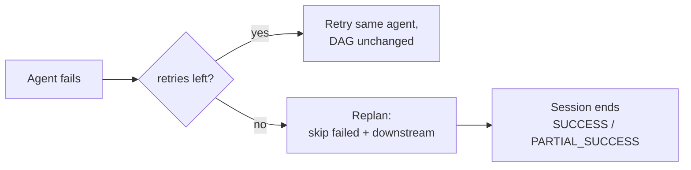

# AutoTeam

**Dynamic multi-agent orchestration** — turns a task into an adaptive team, a validated dependency graph, tool-enabled agents, collaborative artifacts, and a final deliverable.

```
Task
 ↓ Understanding
 ↓ Capability Discovery
 ↓ Role Allocation
 ↓ Agent Factory
 ↓ Dependency DAG
 ↓ Async Scheduler
 ↓ Agent Runtime (Real or Offline Mock)
 ↓ Tool Execution
 ↓ Artifact
 ↓ Collaboration
 ↓ Validation
 ↓ Final Deliverable
```

AutoTeam is an **experimental**, offline-safe, deterministic-by-default framework. Everything runs with **no API key and no network**; a real LLM and real web search are optional, plug-in capabilities.

**Python 3.11+ · `pytest` 174/174 · `ruff` clean · CI: Python 3.11 & 3.12**

---

## Overview

Multi-agent demos usually hard-code three agents and let them print text. AutoTeam treats the team itself as an **output of the system**: it reads the task, discovers required capabilities, forms a role for each capability, builds an agent, selects tools, analyzes dependencies, generates a valid DAG, schedules it, executes it, and assembles the results into a validated, evidence-backed deliverable.

```
Plain multi-agent:
    Task → Agent A / Agent B / Agent C

AutoTeam:
    Task → Understanding → Capability → Role → Agent → Tool → Dependency
         → Execution → Collaboration → Artifact → Final Deliverable
```

The core idea is that **Capability ≠ Role ≠ Agent**:

- a **Capability** is a unit of work the task requires (e.g. `market_research`),
- a **Role** is a persona that can own one or more capabilities (e.g. `Market Researcher`),
- an **Agent** is a runtime instance of a role with a specific LLM provider, output schema, and tool set.

## Why AutoTeam

| | Typical multi-agent demo | AutoTeam |
|---|---|---|
| Team | hard-coded | **derived dynamically from the task** |
| Roles | fixed | **formed to fit required capabilities** |
| Dependencies | none / linear | **analyzed into a validated DAG** |
| Execution | naive loop | **async scheduler with retry + replan** |
| Agent output | free text | **schema-constrained structured artifacts** |
| Downstream | ignores siblings | **reads upstream artifacts + real tool results** |
| Provenance | none | **Sources + Evidence, deterministically validated** |
| LLM | always required | **mock by default, real optional** |

## Core Principle

Every decision flows through a single pipeline — the LLM proposes, a schema constrains, code validates, and the executor runs:

```
LLM proposes        → provider returns a Pydantic-constrained object
Schema constrains    → response_model shapes every structured_completion call
Code validates       → deterministic validation (no LLM judge, no scores)
Executor executes    → scheduler / runtime / tools run the validated plan
```

## Architecture


### Dynamic team formation



### Execution flow (offline vs real)



### Artifact collaboration



### Failure recovery



## Version Evolution

| Version | Capability |
|---|---|
| v0.1.0 | Baseline orchestration engine (analysis, allocation, topologies, async scheduler, evaluation) |
| v0.2.0 | Real Agent Runtime (LLM provider, tool registry, result store, research demo, Live View) |
| v0.3.0 | Dynamic Team Intelligence (task → capability → role → agent → tool → dependency → plan) |
| v0.4.0 | Autonomous Task Completion (session, artifacts, context assembly, collaboration, assembler, retry/replan) |
| v0.5.0 | Real-World Agent Execution (real/mock LLM, executable tools, Sources/Evidence, validation) |

## Killer Demo

```bash
python examples/real_world_demo.py
```

Runs the task **"分析 AI Agent 市场，并设计一个面向中小企业的 Agent 产品方案。"** through the full pipeline — dynamic team formation, parallel execution, tool use, artifact collaboration, evidence collection, validation — and writes a final Markdown deliverable with **Sources** and **Evidence** sections to `autoteam_output/<run_id>.md`.

This needs **no API key** and runs offline end-to-end.

## Quick Start

```bash
git clone <your-repo-url>
cd autoteam
```

```bash
# create a virtual environment
python -m venv .venv
# Windows
.venv\Scripts\activate
# Linux / macOS
source .venv/bin/activate
```

```bash
# install the project (includes [ui, dev] extras)
pip install -e ".[ui,dev]"

# run the full test suite and lint
pytest -q
ruff check .

# run an offline demo
python examples/autonomous_task_demo.py

# run the v0.5.0 killer demo
python examples/real_world_demo.py

# launch the Streamlit UI
streamlit run app/ui.py
```

## Offline Mode

Every demo and every test runs **offline by default — no API key, no network, no database**.

Without configuration AutoTeam still demonstrates the entire pipeline: dynamic team formation, tool selection, dependency analysis, DAG generation, retry, replan, agent runtime, tool execution, artifacts, evidence, collaboration, and the final deliverable. In offline mode the LLM provider is `MockLLMProvider` and `web_search` returns deterministic results labeled `offline_mock` — real URLs are **never fabricated**.

## Real Mode (optional)

AutoTeam supports an **OpenAI / DeepSeek-compatible** LLM provider. Configure it with environment variables (see [.env.example](.env.example)):

```bash
AUTOTEAM_API_KEY=your_key
AUTOTEAM_LLM_PROVIDER=deepseek      # or openai
AUTOTEAM_LLM_MODEL=deepseek-chat
AUTOTEAM_LLM_BASE_URL=https://api.deepseek.com/v1
```

Real web search is also optional and plugs into any HTTP search API:

```bash
AUTOTEAM_WEB_SEARCH_URL=https://your-search-api.example.com
AUTOTEAM_WEB_SEARCH_API_KEY=your_key
```

> **Honest status:** Real LLM and Real Web Search adapters are **implemented**. Since the release preparation, the **Real LLM path has been actually verified** against a live DeepSeek-compatible endpoint (see [Real LLM Verification](#real-llm-verification)). **Real Web Search has not been externally verified** because no vendor credentials were available in the verification environment; its offline fallback (structured `offline_mock` results, empty URLs) is verified and degrades cleanly instead of crashing. The real adapters are not exercised by CI or tests; if no key is present, `get_llm_provider()` returns the mock automatically.

## Real LLM Verification

As part of the final pre-publication pass, a live **DeepSeek-compatible request** was executed with a real API key (kept only in a gitignored local `.env`, never in the repo):

| Capability | Status |
|---|---|
| Offline agent runtime | Verified |
| **Real LLM** | **Implemented + Actually Verified** |
| Calculator (safe AST) | Verified |
| Local Knowledge (path-traversal protected) | Verified |
| **Real Web Search** | **Implemented + Not Verified** (no vendor credentials) |
| Evidence / Sources | Verified |
| Artifact collaboration | Verified |
| Retry / Replan | Verified |

What was actually verified end-to-end with the real LLM: a real DeepSeek request returned meaningful content; a **multi-agent session completed with `SUCCESS`** through dynamic team formation → agent execution → artifacts → Evidence/Sources → downstream agent context → **final artifact generation**. Note this was a single live verification run, not a sustained production test — AutoTeam remains an experimental design study (see [Limitations](#limitations)).

## Tools

`ToolRegistry` exposes `validate()` and `execute()` behind a structured `ToolCall {tool_name, arguments}` schema, returning typed results:

| Tool | Offline | Real |
|---|---|---|
| `web_search` | deterministic `offline_mock` results, empty URLs | HTTP call with timeout, response validation, key never logged |
| `calculator` | safe AST arithmetic — **no `eval`** | same |
| `local_knowledge` | controlled reads of a workspace (`.md/.txt/.json/.csv`), path-traversal blocked | same |
| `mock_search`, `data_analyzer`, `schema_validator`, `code_analysis` | deterministic offline stubs | — |

Structured errors: `ToolNotFound`, `ToolValidationError`, `ToolExecutionError`.

## Evidence

Every claim an agent makes is backed by a registered **Source**:

- `Source {id, title, url, source_type, retrieved_at}` — a retrievable provenance record
- `Evidence {claim, evidence, source_id}` — a claim linked to a source

`source_id` **must exist** in the artifact's sources or the artifact is rejected. Offline sources carry `source_type=offline_mock` and an empty `url`; nothing is fabricated.

## Agent Collaboration

Agents are more than parallel text printers. Each agent emits a schema-constrained **AgentArtifact** that downstream agents actually read:

- Requirement Analyst → `requirements` artifact
- System Architect → `architecture` artifact
- Backend Developer → `implementation-plan` artifact
- Test Engineer → `test-report` artifact

The assembler consumes the artifact graph and produces the final deliverable.

## Failure Recovery

- **Retry** reruns a failed agent without changing the DAG.
- **Replan** triggers after retries are exhausted, skipping the failed agent and its downstream dependents.
- The session ends with a transparent, code-evaluated verdict: `SUCCESS`, `PARTIAL_SUCCESS`, or `FAILED` — **no LLM judge, no scores.**

## Testing

Current verified status:

| Check | Result |
|---|---|
| `pytest -q` | 174 passed |
| `ruff check .` | clean |
| v0.1.0 regression | pass |
| v0.2.0 regression | pass |
| v0.3.0 regression | pass |
| v0.4.0 regression | pass |
| v0.5.0 tests (36) | pass |
| Offline demos | run in CI, no API key |
| UI | import smoke-tested in CI |

## Security

- `calculator` uses an **AST whitelist**, never `eval`.
- `local_knowledge` blocks path traversal and secret-named / non-whitelisted files.
- **API keys never** appear in artifacts, events, logs, or exception messages.
- Secrets and local paths are excluded via `.gitignore`; verified no absolute local paths in the tree.

## Limitations

AutoTeam is an **experimental design study**, not a production platform. Honest boundaries:

- Offline mock results are **not** a substitute for real model quality.
- Real LLM was **verified once against a live DeepSeek-compatible endpoint**; Real Web Search is implemented but **not verified against a live API**.
- Session state is **in-memory** (no persistence, no checkpointing).
- Completeness is judged by **deterministic rules**, not model scoring.
- This is **not** a production-grade distributed execution layer.

## Roadmap

> Future work will be driven by real-world usage rather than version-driven feature expansion.

## Contributing

This is a small, focused project. Contributions and issues are welcome; please keep changes small and aligned with the offline-first, deterministic-design philosophy.

## License

No license has been selected for this project yet.