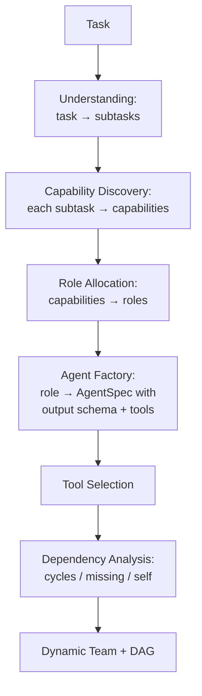
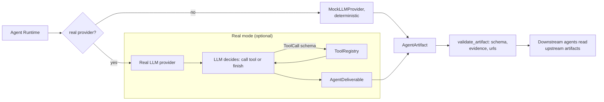
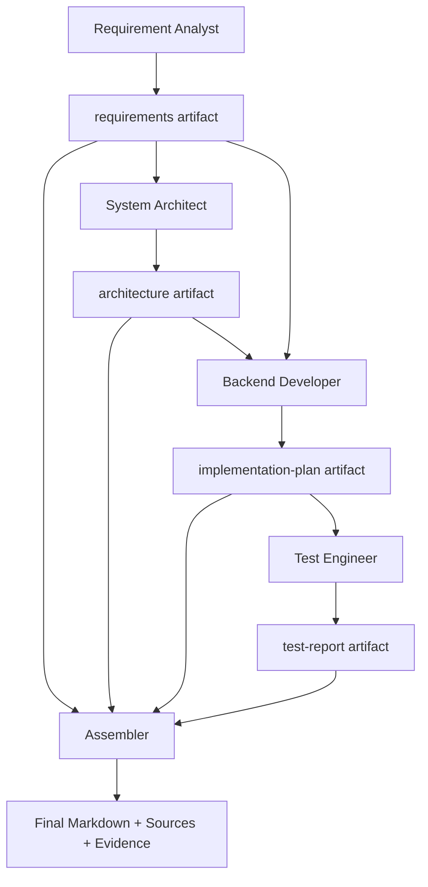
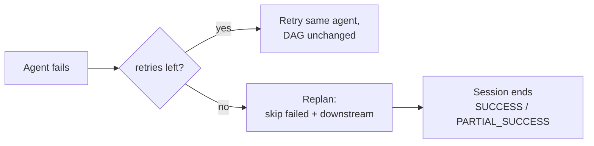

# AutoTeam

**Dynamic multi-agent orchestration** — turns a task into an adaptive team, a validated dependency graph, tool-enabled agents, collaborative artifacts, and an evidence-backed final deliverable.

> AutoTeam is a dynamic multi-agent orchestration framework for **real-world agent execution and evidence-backed research synthesis**.

```
Task
 ↓ Understanding
 ↓ Capability Discovery
 ↓ Role Allocation
 ↓ Agent Factory
 ↓ Dependency DAG
 ↓ Async Scheduler
 ↓ Agent Runtime (Real or Offline Mock)
 ↓ Tool Execution
 ↓ Artifact
 ↓ Collaboration
 ↓ Validation
 ↓ Evidence Filtering
 ↓ Cross-Agent Synthesis (insights · contradictions · trade-offs · recommendations)
 ↓ Final Deliverable
```

AutoTeam is an **experimental**, offline-safe, deterministic-by-default framework. Everything runs with **no API key and no network**; a real LLM and real web search are optional, plug-in capabilities.

**Python 3.11+ · `pytest` 218/218 · `ruff` clean · `npm run build` pass · CI: Python 3.11 & 3.12**

Latest release notes: [RELEASE_NOTES_v0.6.0.md](RELEASE_NOTES_v0.6.0.md)

---

## Overview

Multi-agent demos usually hard-code three agents and let them print text. AutoTeam treats the team itself as an **output of the system**: it reads the task, discovers required capabilities, forms a role for each capability, builds an agent, selects tools, analyzes dependencies, generates a valid DAG, schedules it, executes it, and assembles the results into a validated, evidence-backed deliverable.

```
Plain multi-agent:
    Task → Agent A / Agent B / Agent C

AutoTeam:
    Task → Understanding → Capability → Role → Agent → Tool → Dependency
         → Execution → Collaboration → Artifact → Final Deliverable
```

The core idea is that **Capability ≠ Role ≠ Agent**:

- a **Capability** is a unit of work the task requires (e.g. `market_research`),
- a **Role** is a persona that can own one or more capabilities (e.g. `Market Researcher`),
- an **Agent** is a runtime instance of a role with a specific LLM provider, output schema, and tool set.

## Why AutoTeam

| | Typical multi-agent demo | AutoTeam |
|---|---|---|
| Team | hard-coded | **derived dynamically from the task** |
| Roles | fixed | **formed to fit required capabilities** |
| Dependencies | none / linear | **analyzed into a validated DAG** |
| Execution | naive loop | **async scheduler with retry + replan** |
| Agent output | free text | **schema-constrained structured artifacts** |
| Downstream | ignores siblings | **reads upstream artifacts + real tool results** |
| Provenance | none | **Sources + Evidence, deterministically validated** |
| LLM | always required | **mock by default, real optional** |

## Core Principle

Every decision flows through a single pipeline — the LLM proposes, a schema constrains, code validates, and the executor runs:

```
LLM proposes        → provider returns a Pydantic-constrained object
Schema constrains    → response_model shapes every structured_completion call
Code validates       → deterministic validation (no LLM judge, no scores)
Executor executes    → scheduler / runtime / tools run the validated plan
```

## Architecture

```mermaid
flowchart LR
    T[Task] --> U[Understanding]
    U --> CD[Capability Discovery]
    CD --> RA[Role Allocation]
    RA --> AF[Agent Factory]
    AF --> TS[Tool Selection]
    TS --> DA[Dependency Analysis]
    DA --> G[DAG + validation]
    G --> S[Async Scheduler]
    S --> RT[Agent Runtime]
    RT --> TE[Tool Execution]
    TE --> AR[Artifact]
    AR --> CO[Collaboration]
    CO --> V[Validation]
    V --> FD[Final Deliverable]
```



### Dynamic team formation



### Execution flow (offline vs real)



### Artifact collaboration



### Failure recovery



## Version Evolution

| Version | Capability |
|---|---|
| v0.1.0 | Baseline orchestration engine (analysis, allocation, topologies, async scheduler, evaluation) |
| v0.2.0 | Real Agent Runtime (LLM provider, tool registry, result store, research demo, Live View) |
| v0.3.0 | Dynamic Team Intelligence (task → capability → role → agent → tool → dependency → plan) |
| v0.4.0 | Autonomous Task Completion (session, artifacts, context assembly, collaboration, assembler, retry/replan) |
| v0.5.0 | Real-World Agent Execution (real/mock LLM, executable tools, Sources/Evidence, validation) |
| v0.6.0 | Agent Team Synthesis (evidence filtering, cross-agent insights, contradictions/uncertainties, trade-offs, recommendations, `claim_type`, provenance audit, Result-page readability) |

## Killer Demo

```bash
python examples/real_world_demo.py
```

Runs the task **"分析 AI Agent 市场，并设计一个面向中小企业的 Agent 产品方案。"** through the full pipeline — dynamic team formation, parallel execution, tool use, artifact collaboration, evidence collection, validation, **cross-agent synthesis** — and writes a final Markdown deliverable with **Key Findings / Insights / Contradictions / Trade-offs / Recommendations / Sources / Evidence** to `autoteam_output/<run_id>.md`.

This needs **no API key** and runs offline end-to-end (offline runs are forced to mock tools, so they never hit the network even if search keys exist in the environment).

## Quick Start

```bash
git clone <your-repo-url>
cd autoteam
```

```bash
# create a virtual environment
python -m venv .venv
# Windows
.venv\Scripts\activate
# Linux / macOS
source .venv/bin/activate
```

```bash
# install the project (includes [ui, dev] extras)
pip install -e ".[ui,dev]"

# run the full test suite and lint
pytest -q
ruff check .

# run an offline demo
python examples/autonomous_task_demo.py

# run the killer demo (offline)
python examples/real_world_demo.py
```

## Web UI (AutoTeam — single product entry)

The current product UI is a Vue 3 + TypeScript frontend served by the FastAPI backend (the three historical Streamlit pages below are kept as **Legacy / Historical demos** — they are no longer the product entry point).

```bash
# 1. backend (FastAPI + SSE on :8000)
uvicorn app.api.main:app --reload --port 8000

# 2. frontend (Vite dev server on :5173, proxies /api to :8000)
cd frontend
npm install
npm run dev
```

Open **http://localhost:5173** — enter a task, choose *Offline* or *Real LLM*, then **Build Team & Run**. The Execution page streams real Core events over SSE (agent status, tool calls, artifacts, evidence/sources) and the Result page shows the assembled final deliverable.

Alternatively build the frontend once and let the backend serve it on the same port:

```bash
cd frontend && npm run build && cd ..
uvicorn app.api.main:app --port 8000   # SPA served at http://localhost:8000
```

There is also a one-command launcher once the frontend is built (or with `--dev` to also run the Vite dev server):

```bash
python scripts/start_web.py        # backend only, serves the built SPA
python scripts/start_web.py --dev  # backend + vite dev
```

> Legacy Streamlit pages still run unchanged for historical inspection:
> `streamlit run app/ui.py` (v0.1–0.3 demo) · `app/ui_dynamic.py` · `app/ui_live.py` (v0.4 live view). Tests keep covering them; they are not the official UI anymore.

## Offline Mode

Every demo and every test runs **offline by default — no API key, no network, no database**.

Without configuration AutoTeam still demonstrates the entire pipeline: dynamic team formation, tool selection, dependency analysis, DAG generation, retry, replan, agent runtime, tool execution, artifacts, evidence, collaboration, and the final deliverable. In offline mode the LLM provider is `MockLLMProvider` and `web_search` returns deterministic results labeled `offline_mock` — real URLs are **never fabricated**.

## Real Mode (optional)

AutoTeam supports an **OpenAI / DeepSeek-compatible** LLM provider. Configure it with environment variables (see [.env.example](.env.example)):

```bash
AUTOTEAM_API_KEY=your_key
AUTOTEAM_LLM_PROVIDER=deepseek      # or openai
AUTOTEAM_LLM_MODEL=deepseek-chat
AUTOTEAM_LLM_BASE_URL=https://api.deepseek.com/v1
```

Real web search plugs into a **Tavily-compatible** HTTP JSON endpoint (POST + Bearer):

```bash
AUTOTEAM_WEB_SEARCH_URL=https://api.tavily.com/search
AUTOTEAM_WEB_SEARCH_API_KEY=your_key
```

> **Honest status:** Real LLM and Real Web Search adapters are **implemented**. Since the release preparation, the **Real LLM path has been actually verified** against a live DeepSeek-compatible endpoint and the **Real Web Search adapter verified against Tavily's live API** (see [Real LLM Verification](#real-llm-verification)). API keys are configured by the user only in a gitignored local `.env` — never committed. The offline fallback (structured `offline_mock` results, empty URLs) remains verified and degrades cleanly on any real-request failure. The real adapters are not exercised by CI or tests; if no key is present, `get_llm_provider()` returns the mock automatically and `web_search` stays offline.

## Real LLM Verification

As part of the final pre-publication pass, a live **DeepSeek-compatible request** was executed with a real API key (kept only in a gitignored local `.env`, never in the repo), and a **real Tavily web search** was verified end-to-end:

| Capability | Status |
|---|---|
| Offline agent runtime | Verified |
| **Real LLM** | **Implemented + Actually Verified** |
| Calculator (safe AST) | Verified |
| Local Knowledge (path-traversal protected) | Verified |
| **Real Web Search (Tavily)** | **Implemented + Actually Verified** 🔍 |
| Evidence / Sources | Verified |
| Artifact collaboration | Verified |
| Retry / Replan | Verified |
| **Agent Team Synthesis (v0.6.0)** | **Implemented + Actually Verified** |

What was actually verified end-to-end with the real LLM: a real DeepSeek request returned meaningful content; a **multi-agent session completed with `SUCCESS`** through dynamic team formation → agent execution → artifacts → Evidence/Sources → downstream agent context → **final artifact generation**. The **real web_search adapter was executed against Tavily's live API** with genuine results and real URLs flowing into Sources and Evidence (offline fallback re-verified separately; no fabricated URLs, no key leakage).

v0.6.0 was additionally verified live on the release-brief task (AI Agent market + SME product plan): a real-provider run completed with `success`, 5 agents produced substantive artifacts, synthesis completed (10 findings, 4 insights, 2 contradictions, 6 uncertainties, 3 trade-offs, 6 recommendations), 8 real Tavily sources with 8 genuine URLs, and **0 dangling reference issues**. Tool kinds in that run were transparently reported as `web` + `offline_mock` + `local`. A later real run hit an invalid-JSON synthesis failure: the run still completed with the report marked `synthesis_status = degraded` and **no invented insights** — real synthesis reliability is provider-dependent and not guaranteed. Note these were live verification runs, not sustained production testing — AutoTeam remains an experimental design study (see [Limitations](#limitations)).

## Tools

`ToolRegistry` exposes `validate()` and `execute()` behind a structured `ToolCall {tool_name, arguments}` schema, returning typed results:

| Tool | Execution nature | Notes |
|---|---|---|
| `web_search` | `web` / `offline_mock` / `offline_fallback` | **Tavily-compatible POST** (Bearer, timeout, response validation, key never logged); without keys it returns deterministic `offline_mock` results with empty URLs; a failed real call degrades to `offline_fallback` and is labelled as such |
| `calculator` | `local` | safe AST arithmetic — **no `eval`** (a real local tool, not a mock) |
| `local_knowledge` | `local` | controlled reads of a workspace (`.md/.txt/.json/.csv`), path-traversal blocked |
| `mock_search`, `data_analyzer`, `schema_validator`, `code_analysis` | `offline_mock` | deterministic offline stubs |

Every `ToolResult` carries an honest `kind` (`web` \| `local` \| `offline_mock` \| `offline_fallback`) that is recorded in the execution trace and shown in the UI. A Real run does **not** imply every tool is Real, and a local deterministic tool is never mislabelled as a mock.

Structured errors: `ToolNotFound`, `ToolValidationError`, `ToolExecutionError`.

## Evidence

Every claim an agent makes is backed by a registered **Source**:

- `Source {id, title, url, source_type, retrieved_at}` — a retrievable provenance record
- `Evidence {claim, evidence, source_id, evidence_id, producer_agent, artifact_id, claim_type}` — a claim linked to a source

`source_id` **must exist** in the artifact's sources or the artifact is rejected. Offline sources carry `source_type=offline_mock` and an empty `url`; nothing is fabricated. Source URLs are only rendered as clickable links when they are valid `http(s)`.

## Agent Team Synthesis (v0.6.0)

After the DAG finishes, a deterministic **Evidence Filter** normalises all agent artifacts into `EvidenceRecord[]` + `SourceRecord[]` (stable ids, merged duplicates, full producer provenance). A cross-agent synthesis pass then produces, under schema constraints and deterministic validation:

- **Key Findings** — with a support status derived from the *cited evidence* (multi-source / single-source / insufficient), never from a raw count;
- **Cross-Agent Insights** — combining multiple evidence items; a single-agent insight is labelled as such, not dressed up;
- **Contradictions & Uncertainties** — the system never picks a winner when evidence is insufficient;
- **Trade-offs** — derived from the task's actual options (no hardcoded dimensions, a single viable option may yield none);
- **Recommendations** — traceable to insights / trade-offs / evidence, with status `supported` / `potential` / `unsupported`.

Citations are validated in code: unknown `evidence_id`s are dropped, recommendation → insight / trade-off links are reconciled, and a **reference audit** reports dangling references so the UI can say “reference missing” instead of inventing a link.

### Data nature: `claim_type`

Numeric / business claims can be tagged (optional, backward-compatible) as `source_fact`, `derived_estimate`, `planning_assumption` or `unverified_claim`. An unknown or missing tag is left **unclassified** — the system never guesses a data nature from formatting. `derived_estimate` items carry their inputs/method in `derivation`. These tags are model-proposed labels validated against a whitelist — a label, not an independent fact-check.

## Agent Collaboration

Agents are more than parallel text printers. Each agent emits a schema-constrained **AgentArtifact** that downstream agents actually read:

- Requirement Analyst → `requirements` artifact
- System Architect → `architecture` artifact
- Backend Developer → `implementation-plan` artifact
- Test Engineer → `test-report` artifact

The assembler consumes the artifact graph and produces the final deliverable.

## Failure Recovery

- **Retry** reruns a failed agent without changing the DAG.
- **Replan** triggers after retries are exhausted, skipping the failed agent and its downstream dependents.
- The session ends with a transparent, code-evaluated verdict: `SUCCESS`, `PARTIAL_SUCCESS`, or `FAILED` — **no LLM judge, no scores.**

## Testing

Current verified status:

| Check | Result |
|---|---|
| `pytest -q` | 218 passed |
| `ruff check .` | clean |
| Web API (`tests/test_api.py`) | health / create / team / events / artifacts / result + E2E, offline |
| v0.1.0–v0.5.0 regression | pass |
| v0.6.0 synthesis tests | pass (evidence filtering, support derivation, `claim_type`, reference audit, degraded/legacy fallback) |
| Tool-kind & offline-determinism tests | pass |
| Offline E2E (`examples/real_world_demo.py`) | SUCCESS, `offline_mock` sources |
| Offline demos | run in CI, no API key |
| UI | import smoke-tested in CI; Vue frontend `npm run build` (vue-tsc strict + Vite) passes |
| Frontend unit tests | none configured in this repo |
| Security scan (tracked files) | no tracked secrets / logs / absolute paths |

Real E2E was also executed manually with the configured provider + Tavily (see [Real LLM Verification](#real-llm-verification)); report quality was inspected manually, not inferred from task status.

## Web UI

The product UI (introduced at the v0.5.0 finalization) is a single Vue 3 + TypeScript frontend:

```
frontend/
├── src/
│   ├── views/          Workspace · Execution · Team · Artifacts · Result
│   ├── components/     status badge + provenance reference chips
│   ├── stores/team.ts  Pinia store (SSE-driven live state)
│   └── api/client.ts   typed client for the FastAPI endpoints
app/api/
├── main.py             FastAPI app (optionally serves the built SPA)
├── routes.py           /api/health · /api/tasks · /team · /events · /artifacts · /result · /stream
├── runs.py             background-thread run registry (reuses execute_task)
└── models.py           DTOs
```

- **SSE** (`GET /api/tasks/{id}/stream`) replays the Core's real `ExecutionTrace` — no faked events, no timers in the frontend.
- Agent status, tool calls, artifacts, evidence and sources all come from the existing Core objects.
- The **Result page** separates the readable report body from traceability: Key Findings / Insights / Contradictions / Trade-offs / Recommendations are structured blocks with support status, data nature and provenance; internal ids (evidence / insight / trade-off / artifact) live in expandable details; recommendations expand into a `Recommendation → Insight/Trade-off → Evidence → Source` chain (unresolved ids render as “reference missing”).
- Tool chips read `tool_kind` from real execution events, so `web` / `local` / `offline_mock` / `offline_fallback` are shown accurately.
- `npm run build` passes (vue-tsc strict + Vite production build).

## Security

- `calculator` uses an **AST whitelist**, never `eval`.
- `local_knowledge` blocks path traversal and secret-named / non-whitelisted files.
- **API keys never** appear in artifacts, events, logs, or exception messages.
- Secrets and local paths are excluded via `.gitignore`; verified no absolute local paths in the tree.

## Limitations

AutoTeam is an **experimental design study**, not a production platform. Honest boundaries:

- Offline mock results are **not** a substitute for real model quality.
- Real LLM and Real Web Search (Tavily) were **verified against live APIs** during pre-publication smoke testing (not sustained production testing).
- Synthesis is **evidence-grounded but not fact-checked**: `claim_type` and insights are model-proposed, then deterministically constrained (id resolution, support derivation, whitelist). Market numbers come from the cited sources and are not independently audited by AutoTeam.
- **Real synthesis reliability is provider-dependent and not guaranteed**: a real model can return invalid JSON for the synthesis schema. The run then degrades transparently (`synthesis_status = degraded`, artifact-level findings) instead of fabricating insights.
- A cross-agent insight is only labelled cross-agent when its cited evidence comes from ≥2 agents; otherwise it is shown as single-agent.
- Session state is **in-memory** (no persistence, no checkpointing).
- Completeness is judged by **deterministic rules**, not model scoring.
- This is **not** a production-grade distributed execution layer and makes **no** “fully autonomous” or “100% accurate” claim.

## Roadmap

> Future work will be driven by real-world usage rather than version-driven feature expansion.

## Contributing

This is a small, focused project. Contributions and issues are welcome; please keep changes small and aligned with the offline-first, deterministic-design philosophy.

## License

No license has been selected for this project yet.