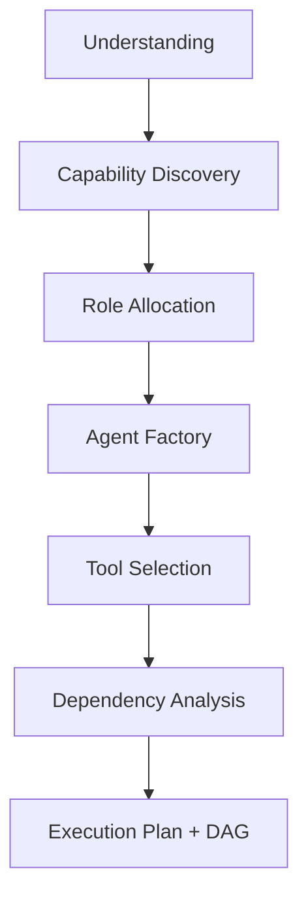

# AutoTeam Architecture

> This document explains the system design at the module level — responsibilities, inputs, outputs, and how modules relate. It is not a line-by-line source walkthrough.

## Core Principle

```
LLM proposes  →  Schema constrains  →  Code validates  →  Executor executes
```

Every decision follows this single pipeline. The LLM (or the deterministic mock) proposes an object; a Pydantic schema constrains its shape; code validates it deterministically; the scheduler/runtime executes it.

## Overall Architecture

```mermaid
flowchart LR
    T[Task] --> U[Understanding]
    U --> CD[Capability Discovery]
    CD --> RA[Role Allocation]
    RA --> AF[Agent Factory]
    AF --> TS[Tool Selection]
    TS --> DA[Dependency Analysis]
    DA --> G[DAG]
    G --> S[Async Scheduler]
    S --> RT[Agent Runtime]
    RT --> TE[Tool Execution]
    TE --> AR[Artifact]
    AR --> V[Validation]
    V --> CO[Collaboration]
    CO --> EF[Evidence Filter]
    EF --> SY[Cross-Agent Synthesis]
    SY --> A[Assembler]
    A --> FD[Final Deliverable]
```



## Task Understanding

- **Module(s):** `app/runtime/understanding.py`, `app/runtime/decomposer.py`
- **Responsibility:** Turn a free-form task into one or more concrete subtasks.
- **Input:** task description.
- **Output:** subtask plan.
- **Relations:** feeds capability discovery.

## Dynamic Team Formation



### Capability Discovery

- **Module:** `app/runtime/capability_discovery.py`
- **Responsibility:** Map each subtask to the capabilities required to complete it.
- **Input:** subtask plan.
- **Output:** per-subtask capability set.
- **Relations:** the first step where **Capability ≠ Role ≠ Agent** matters.

### Role Allocation

- **Module:** `app/runtime/role_allocation.py`
- **Responsibility:** Group capabilities into personas (roles). A role may own several capabilities.
- **Input:** capabilities.
- **Output:** roles.
- **Relations:** feeds the agent factory.

### Agent Factory

- **Module:** `app/runtime/agent_factory.py`
- **Responsibility:** Instantiate a runtime agent from a role — attach a name, an output schema, and a tool set.
- **Input:** role (+ provider and tool config).
- **Output:** `AgentSpec`.
- **Relations:** the concrete executable unit scheduled by the DAG.

## Tool Selection

- **Module:** `app/runtime/tool_selector.py`, `app/tools/registry.py`
- **Responsibility:** Decide which tools an agent may call and resolve them to executable implementations.
- **Input:** agent capability / role.
- **Output:** a set of tool names.
- **Relations:** the registry performs actual execution.

## Dependency Analysis

- **Module:** `app/runtime/dependency.py`
- **Responsibility:** Determine which subtasks must run before others; detect cycles, missing, and self-dependencies.
- **Input:** subtasks.
- **Output:** dependency edges.
- **Relations:** produces the graph the DAG validator checks.

## DAG & Validation

- **Module:** `app/topology/*`
- **Responsibility:** Build and validate the execution topology as a directed acyclic graph.
- **Input:** dependency edges.
- **Output:** a valid DAG.
- **Relations:** the scheduler consumes this DAG directly.

## Async Scheduler

- **Module:** `app/scheduler/scheduler.py`
- **Responsibility:** Run agents in dependency order, in parallel where possible.
- **Input:** DAG + agent list.
- **Output:** per-agent execution results.
- **Relations:** drives the agent runtime; owns retry and replan.

## Agent Runtime

- **Module:** `app/runtime/agent_runtime.py`
- **Responsibility:** Execute one agent: assemble context, call the LLM provider (or mock), run tool-calling, build a validated artifact.
- **Input:** `AgentSpec` + execution context (upstream artifacts).
- **Output:** `AgentArtifact`.
- **Relations:** sits between the scheduler and the LLM/tool layers.

## Tool Execution

- **Module:** `app/tools/registry.py`, `app/tools/calculator.py`, `app/tools/local_knowledge.py`
- **Responsibility:** Execute a structured `ToolCall` safely, returning typed `ToolResult`s and `Source`s.
- **Input:** `ToolCall {tool_name, arguments}`.
- **Output:** `ToolResult` (+ provenance for `web_search`) with an honest `kind` — `web` (real search succeeded) / `local` (real local deterministic tool) / `offline_mock` (deterministic stub) / `offline_fallback` (real call failed, degraded).
- **Errors:** `ToolNotFound`, `ToolValidationError`, `ToolExecutionError`.
- **Relations:** the runtime records `tool_kind` in the `TOOL_CALLED` trace event; the UI reads it. Offline sessions force mock tools so they cannot reach the network.

## Artifact System

- **Module:** `app/runtime/artifacts.py`
- **Responsibility:** Represent every agent's structured, addressable result.
- **Input:** agent deliverable + tool results.
- **Output:** `AgentArtifact` with `structured_data`, `sources`, `evidence`.
- **Relations:** the currency passed between collaborating agents.

## Artifact Validation

- **Module:** `app/runtime/validation.py`
- **Responsibility:** Deterministically reject malformed artifacts before they propagate: empty schema, evidence referencing an unknown source, non-http urls.
- **Input:** `AgentArtifact`.
- **Output:** validation pass or `ArtifactValidationError`.
- **Relations:** runs at artifact creation and again before assembly.

## Agent Collaboration

- **Module:** `app/runtime/context.py`
- **Responsibility:** Give each agent only its transitive upstream artifacts plus its own subtask info — never global state.
- **Input:** agent + scheduler context.
- **Output:** an `AgentExecutionContext`.
- **Relations:** lets a backend agent read its architect's artifact.

## Evidence / Source

- **Module:** `app/runtime/artifacts.py`, `app/runtime/validation.py`
- **Responsibility:** Attach provenance to claims. Every `Evidence.source_id` must reference a `Source` in the artifact.
- **Input:** tool results → `Source`s; deliverable key points → `Evidence`.
- **Output:** verified evidence lists. `Evidence` carries `evidence_id`, `producer_agent`, `artifact_id` and an optional `claim_type`.
- **Relations:** offline sources are explicitly `offline_mock` with empty urls.

## Evidence Filtering & Agent Team Synthesis (v0.6.0)

- **Modules:** `app/synthesis/` (`evidence_filter.py`, `synthesizer.py`, `pipeline.py`, `assembler.py`, `models.py`)
- **Responsibility:** Turn the finished agent artifacts into an evidence-backed report.
  - **Evidence Filter** (deterministic): `AgentArtifact[]` → `EvidenceRecord[]` + `SourceRecord[]`; stable ids, merge duplicates by id/URL, keep producer + artifact provenance, strip non-http URLs.
  - **Cross-Agent Synthesis** (LLM proposes, schema constrains, code validates): findings, insights, contradictions, uncertainties, trade-offs, recommendations.
- **Deterministic validation:** unknown `evidence_id`s are dropped; recommendation → insight / trade-off links are reconciled; finding `support_kind` and insight `contributing_agents` are derived from the *cited* evidence; `validate_report_references` audits for duplicate / dangling references.
- **Data nature:** optional `claim_type` ∈ `source_fact` / `derived_estimate` / `planning_assumption` / `unverified_claim`; unknown values normalise to unclassified — never guessed.
- **Relations:** runs in `execute_task` after artifacts are collected; on failure the session degrades to the legacy `ArtifactAssembler` and records `synthesis_status = degraded/failed`. It never joins the DAG and never replaces the scheduler.

## Retry / Replan

- **Module:** `app/scheduler/retry.py`, `app/scheduler/replan.py`
- **Responsibility:** Recover from agent failure. **Retry** reruns the agent without changing the DAG; **Replan** triggers after retries are exhausted, skipping the failed agent and its downstream dependents.
- **Input:** scheduler failure signals.
- **Output:** retried / replanned execution → `SUCCESS` or `PARTIAL_SUCCESS`.

## Final Deliverable

- **Module:** `app/synthesis/assembler.py` (v0.6 path), `app/runtime/assembler.py` (legacy fallback)
- **Responsibility:** Consume the validated artifact graph + synthesis bundle and produce a readable final report.
- **Input:** artifacts + agent order + `ReportBundle`.
- **Output:** `FinalArtifact.to_markdown()` — Executive Summary, Key Findings, Cross-Agent Insights, Contradictions & Uncertainties, Trade-offs, Recommendations, agent sections, **Evidence**, **Sources**.
- **Relations:** the top-level result returned to the user and saved to Markdown; the session degrades to the legacy assembler when synthesis cannot produce a valid result.

## Module Layout

```
app/
├── models/        Pydantic schemas: Task, Capability, AgentSpec, Topology, etc.
├── analyzer/      rule-based task analysis (offline first)
├── allocator/     Capability → Role → AgentSpec allocation
├── llm/           LLM provider abstraction (mock + OpenAI/DeepSeek compatible)
├── topology/      templates, DAG generator, DAG validator
├── scheduler/     async DAG scheduler, retry, replan
├── evaluation/    metrics, policy, evaluator
├── runtime/       understanding, capability, role, factory, tools, dependency,
│                  artifacts, context, session, assembler, validation, events
├── synthesis/     evidence filter, cross-agent synthesis, reference audit,
│                  report assembler (v0.6.0 — runs after the DAG, not part of it)
└── tools/         ToolRegistry: web_search, calculator, local_knowledge, + stubs
```